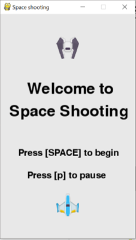
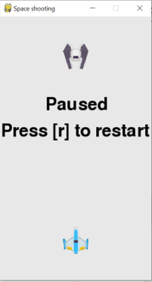
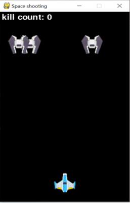

# Space-shooting---pygame

A little space shooting game made by pygame

# Project Intro

## 1. Modules contained

#### (1) Pygame

#### (2) Random

#### (3) Time

## 2. Brief description about the project

##### This project is a shooting game, what user can do in this game is …

#### (1) Control the spaceship with

- Up (Key_up)
- Down (Key_down)
- Right (Key_right)
- Left (Key_left)
- Shoot (Key_space)

#### (2) Different function

- Start game (Key_space)
  
- Pause (Key_p)
- Restart (Key_r)

  

#### (3) Shooting the enemy

##### There is a “kill count” on the top left of the screen which user can see how many enemies they’ve killed

#### (4) Exit game

##### If the enemy and space ship collides, the game will be over

## Brief introduction of each file included

### 1. PNG file

#### (1) Blueship.png

- a graph for the spaceship

#### (2) Enemy.png

- a graph for the enemy

### 2. WAV file

#### (1) Shooting.wav

- a shooting sound for shooting the bullets

#### (2) Exploding.wav

- a explosion sound when bullet and enemy collide

#### (3) Game_over.wav

- a game over sound when the space ship and enemy collide

### 3 .py file

- A project.py file that contains all the code in it, this file allows the user to simply run the file and initiate the game.

### 4. code description.txt

- Includes the description of the code

## References

### 1. Youtube video

- https://www.youtube.com/watch?v=VO8rTszcW4s
- https://www.youtube.com/watch?v=ujOTNg17LjI&list=PLQVvvaa0QuDdLkP8MrOXLe_rKuf6r80KO

### 2. Pygame official website

- https://www.pygame.org/news

### 3. Image website

- https://opengameart.org/content/space-shooter-redux
